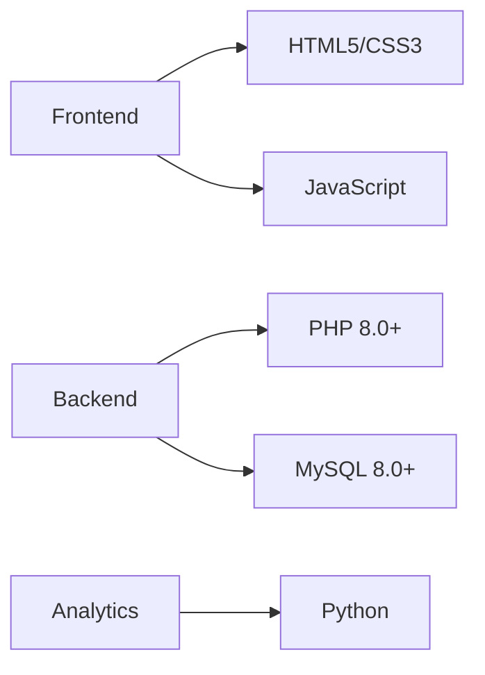

# Smart Inventory 🚀

<div align="center">


[](https://www.php.net/)
[](https://www.mysql.com/)

</div>

## 🎯 Overview

Smart Inventory is a powerful, modern inventory management solution that revolutionizes how businesses track inventory, manage sales, and handle supplier relationships. Built with scalability and efficiency in mind, it leverages PHP and MySQL to deliver a robust enterprise-grade system.

## ✨ Key Features

<details>
<summary>🔐 Security & Authentication</summary>

- Role-based access control
- Secure password hashing
- Session management
- Two-factor authentication ready
</details>

<details>
<summary>📦 Inventory Control</summary>

- Real-time stock tracking
- Barcode integration
- Low stock alerts
- Batch processing
</details>

<details>
<summary>💹 Sales Management</summary>

- Point of Sale (POS)
- Invoice generation
- Payment tracking
- Returns processing
</details>

## 🛠️ Tech Stack



## 🚀 Quick Start

```bash
# Clone repository
git clone https://github.com/GovardhaneNitin/smart-inventory.git

# Navigate to project
cd smart-inventory

# Import database
mysql -u root -p smart_inventory < Database/smart_inventory.sql
```

## 📁 Project Structure

```
smart-inventory/
├── assets/           # Static resources
├── pages/           # View templates
├── Database/        # SQL schemas
├── src/             # Core logic
└── config/          # Configuration files
```

## 🌟 Contributing

We welcome contributions! Please check our [Contributing Guidelines](CONTRIBUTING.md) for details.

## 📄 License

This project is MIT licensed - see [LICENSE](LICENSE) for details.

## 🤝 Support

Need help? Join our [Discord community](https://discord.gg/smartinventory) or create an issue.

---

<div align="center">
Made with ❤️ by the Smart Inventory Team
</div>
